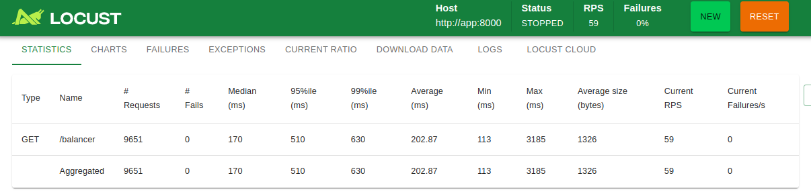
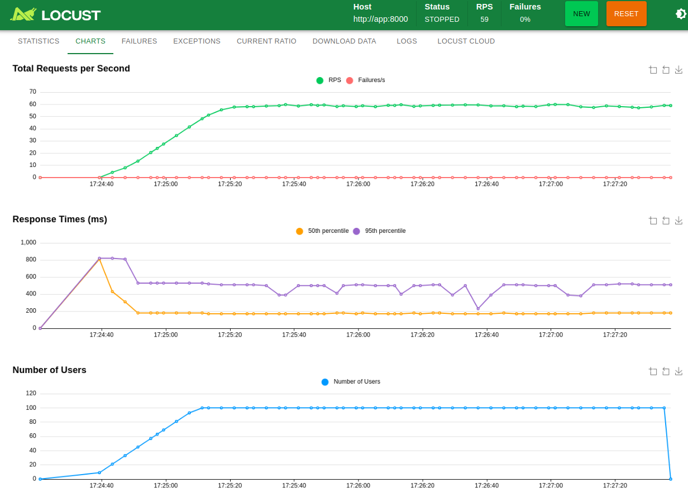

# "Игрушечный" сервис балансировки нагрузки

---

## Краткое описание
Сервис предоставляет простой механизм балансировки запросов между основным сервером и CDN с настраиваемыми параметрами распределения трафика.

С полным описанием можно ознакомиться в [файле](docs_md/Тестовое%20задание.pdf).

---

## API сервиса

### Получение актуального URL запрашиваемого видео

`GET /balancer`

Возвращает редирект (301) на видео-контент, распределяя запросы между основным сервером и CDN.

__Важно!!! Данный API не будет корректно работать через swagger из-за редиректа.__

#### Параметры запроса:

- video (string, URI) - URL видео для загрузки

#### Логика работы:

Каждый N-й запрос перенаправляется на основной сервер.<br>
Остальные запросы перенаправляются на CDN, где N - параметр balancing_factor из конфигурации.

#### Пример запроса:

```
GET /balancer?video=https://example.com/videos/123.mp4
```

### Получение параметров балансировщика

`GET /balancer-config`

Возвращает текущую конфигурацию балансировщика.

#### Формат ответа (200 OK):

```json
{
  "cdn_host": "cdn.example.com",
  "balancing_factor": 5,
  "current_request_num": 42
}
```

#### Поля ответа:

- `cdn_host` - хост CDN сервера
- `balancing_factor` - параметр балансировки (каждый N-й запрос идет на основной сервер)
- `current_request_num` - счетчик общего количества запросов к `/balancer`


### Изменение параметров балансировщика

`PATCH /balancer-config`

Позволяет изменить параметры балансировщика.

#### Тело запроса

```json
{
  "cdn_host": "new.cdn.example.com",
  "balancing_factor": 10
}
```

__Примечания__:

- Можно передавать как оба параметра, так и только один из них
- Непереданные параметры остаются без изменений
- Счетчик `current_request_num` не сбрасывается при обновлении конфигурации

#### Формат ответа (200 OK):

```json
{
  "cdn_host": "new.cdn.example.com",
  "balancing_factor": 10,
  "current_request_num": 42
}
```

---

## Пример использования

1. Запускаем сервис
2. Получаем текущую конфигурацию: `GET /balancer-config`
3. Обновляем параметры:
    
    `PATCH /balancer-config`
    ```json
    {
      "balancing_factor": 3
    }
    ```
4. Запрашиваем видео:
    ```
    GET /balancer?video=https://example.com/video1.mp4
    → 307 Redirect to: cdn.example.com/video1.mp4

    GET /balancer?video=https://example.com/video2.mp4
    → 307 Redirect to: cdn.example.com/video2.mp4

    GET /balancer?video=https://example.com/video3.mp4
    → 307 Redirect to: primary-server.example.com/video3.mp4
    ```

---

## Запуск сервиса

Для запуска сервиса можно использовать [docker-compose.yaml](./docker/docker-compose.yaml):

```shell
cd ./docker
docker compose -f ./docker-compose.yaml up
```

Для доступа к `swagger` можно перейти по адресу: `http://localhost:8000/docs`

__Примечания__:
- *Хост CDN* задается с помощью переменной окружения `CDN_HOST` в [docker-compose.yaml](./docker/docker-compose.yaml)
- *Соотношение редиректов* задается с помощью переменной окружения `BALANCING_FACTOR` в 
[docker-compose.yaml](./docker/docker-compose.yaml)

При запуске приложения в БД создается таблица `balancing`.
Из нее удаляются все данные (если приложение запускалось до этого) и записываются новые параметры балансировки.

## Запуск тестов

Для запуска тестов можно использовать [docker-compose-tests.yaml](./docker/docker-compose-tests.yaml):

```shell
cd ./docker
docker compose -f ./docker-compose-tests.yaml up
```

## Нагрузочное тестирование

Нагрузочное тестирование осуществляется с помощью [locust](https://locust.io/)

Для запуска нагрузочного тестирования можно использовать [docker-compose-performance-test.yaml](./docker/docker-compose-performance-test.yaml):

```shell
cd ./docker
docker compose -f ./docker-compose-performance-test.yaml up
```

После запуска необходимо открыть UI, доступный по адресу http://localhost:8089.

В UI можно настроить:
- Общее число пользователей
- Количество пользователей, начинающих работу, в секунду
- Длительность теста (Advanced options)


#### Результат нагрузочного теста

- Длительность: 3 минуты
- Общее число пользователей: 100
- Количество пользователей, начинающих работу за одну секунду: 3

__Статистика__:



__Графики__:


